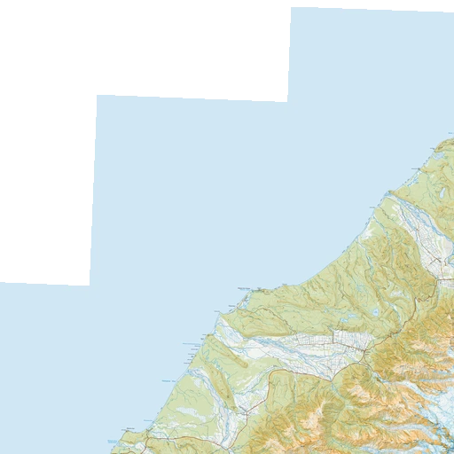

# fastShrinkOnLoad imagery artifacts

When greatly resizing image with `fastShrinkOnLoad:true` produces edge artifacts with sharp borders

given a source image 512x512 



then resizing down to 32x32, then blowing the image back to 128x128 produces the following outputs:


Turning off fastShrinkOnLoad reduces the artifacts but introduces new ones


Switching to Mitchell kernel reduces the white of lanczos


Filling in the background with a consistent color also fixes the shrink on load


### Usage


Install dependencies

```
npm install
```

generate the images

```
node index.mjs
```